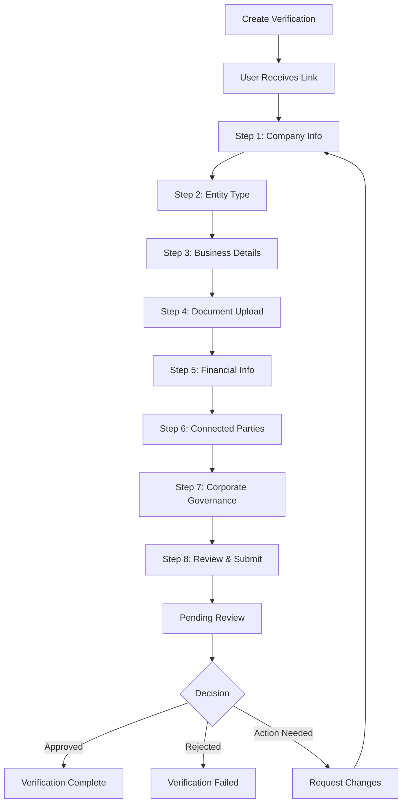

## Overview



## Steps Detail

### Step 1: Company Info

Basic contact information:
- **Legal Entity Name** - Full legal name of the company
- **Contact Name** - Primary contact person
- **Contact Channel** - Telegram, WhatsApp, WeChat, or Email
- **Contact Info** - Phone number or email address
- **Sales Representative** - Your internal sales rep (if applicable)
- **Language** - Preferred communication language

### Step 2: Entity Type

Selection of business structure:
- **Corporation**
- **Partnership**
- **Trust**
- **Foundation**
- **Non-profit Organization**
- **Government Entity**

<Info>
  Different entity types may require different documents in subsequent steps.
</Info>

### Step 3: Business Details

3 sub-steps for comprehensive business information:

#### Sub-step 3.1: Location
- Country of incorporation
- Operating countries (multiple allowed)

#### Sub-step 3.2: Source of Funds
- Primary sources of business revenue
- Investment sources

#### Sub-step 3.3: Business Nature
- Nature of business (dropdown)
- Custom description if "Others" selected

### Step 4: Document Upload

4 sub-steps for corporate documentation:

#### Sub-step 4.1: Basic Information
- Company name (English)
- Company name (Chinese, if applicable)
- Previous name (if changed)
- Date of establishment
- Registration number
- Website URL

#### Sub-step 4.2: Address
- Registered address
- Proof of registered address document
- Business address (if different)
- Proof of business address document

#### Sub-step 4.3: Corporate Documents
- Certificate of Incorporation
- Articles of Association
- Employment Certificate
- Certificate of Good Standing

#### Sub-step 4.4: Additional Information
- Any additional notes
- Supporting documents

### Step 5: Financial Information

3 sub-steps for financial details:

#### Sub-step 5.1: Source of Funds
- Source of funds types (multiple)
- Source of wealth
- Other details

#### Sub-step 5.2: Financial Details
- Tax ID
- VAT/GST number
- Estimated annual turnover
- Estimated net assets
- Estimated liquid assets
- Trading activity duration
- Monthly trading volume

#### Sub-step 5.3: Additional
- Account purpose
- Additional financial information

### Step 6: Connected Parties

4 sub-steps for beneficial ownership:

#### Sub-step 6.1: Structure Level
- Organizational structure complexity:
  - Simple Structure (≤ 3 layers)
  - Multiple Structure (4 layers)
  - Complex Structure (> 4 layers)
- Shareholders' registered locations

#### Sub-step 6.2: Applicable Roles
Select applicable party types:
- **Director** (required)
- **Authorized Person** (required)
- **Ultimate Beneficial Owner (UBO)** (optional)
- **Principal** (optional)
- **Trustee** (optional)
- **Beneficiary** (optional)
- **Corporate Shareholder** (optional)

#### Sub-step 6.3: Personnel Information
For each selected role, add personnel with:
- First and last name
- Email and phone
- Nationality
- ID type and number
- Job position
- Proof of Identity (POI) document

<Info>
  Personnel can be reused across multiple roles. Once added as a UBO, they can be quickly assigned as Director without re-entering details.
</Info>

#### Sub-step 6.4: Additional Information
- Additional notes about connected parties
- Supporting documents

### Step 7: Corporate Governance

2 sub-steps for governance structure:

#### Sub-step 7.1: Governance Questions
- **Governance Structure Chart** (required upload)
- **DAO/Decentralized Governance** - Yes/No question
- **Client Due Diligence** - Whether due diligence on own clients has been conducted

#### Sub-step 7.2: Additional Information
- Additional governance notes
- Summary and confirmation

### Step 8: Review & Submit

Final review of all information:
- Summary of all sections
- Document previews
- Edit any section
- Final submission

## Status Tracking

### Progress Steps

| Step | Name | Sub-steps |
|------|------|-----------|
| 0 | Company Info | - |
| 1 | Entity Type | - |
| 2 | Business Details | Location, Source of Funds, Business Nature |
| 3 | Document Upload | Basic Info, Address, Corporate Docs, Additional |
| 4 | Financial Info | Source of Funds, Financial Details, Additional |
| 5 | Connected Parties | Structure, Roles, Personnel, Additional |
| 6 | Corporate Governance | Governance Questions, Additional Info |
| 7 | Review & Submit | - |

### Sub-step Tracking

The API tracks progress within each step:

```json
{
  "progress": {
    "currentStep": 5,
    "currentAccountTypeStep": 3,
    "currentDocumentStep": 2,
    "currentFinancialStep": 1,
    "currentConnectedPartiesStep": 3,
    "currentCorporateGovernanceStep": 1
  }
}
```

## Submitted Data Structure

```json
{
  "submittedData": {
    "companyInfo": {
      "contactName": "John Doe",
      "contactInfo": "+65 9123 4567",
      "contactChannel": "telegram",
      "legalEntityName": "Acme Pte Ltd",
      "salesRep": "Jane Smith",
      "language": "english"
    },
    "accountType": {
      "entityType": "Corporation",
      "incorpCountry": { "name": "Singapore" },
      "operatingCountries": [{ "name": "Singapore" }],
      "sourceOfFunds": [{ "name": "Business Revenue" }],
      "natureOfBusiness": "Software Development"
    },
    "documents": {
      "companyNameEn": "Acme Pte Ltd",
      "registrationNumber": "202012345K",
      "dateOfEstablishment": "2020-01-15",
      "registeredAddress": "1 Raffles Place, Singapore",
      "certificateOfIncorporation": "https://storage.../cert.pdf"
    },
    "financialInfo": {
      "sourceOfFundsTypes": ["Business Revenue"],
      "sourceOfWealth": ["Business Ownership"],
      "estimatedAnnualTurnover": "$1M - $5M",
      "accountPurpose": "Business Operations"
    },
    "connectedParties": {
      "structureLevel": "Simple Structure - <= 3 layers",
      "applicableRoles": ["director", "auth_person"],
      "connectedParties": [{
        "role": "director",
        "firstName": "John",
        "lastName": "Doe",
        "email": "john@acme.com",
        "nationality": { "name": "Singapore" }
      }]
    },
    "corporateGovernance": {
      "governanceChart": "https://storage.../chart.pdf",
      "isDAO": false,
      "conductedDueDiligence": true
    },
    "submittedAt": "2024-01-15T10:30:00Z",
    "subjectType": "KYB"
  }
}
```

## Time to Complete

| Step | Estimated Time |
|------|---------------|
| Company Info | 2-3 minutes |
| Entity Type | 1 minute |
| Business Details | 5-7 minutes |
| Document Upload | 10-15 minutes |
| Financial Info | 5-8 minutes |
| Connected Parties | 10-15 minutes |
| Corporate Governance | 3-5 minutes |
| Review | 3-5 minutes |
| **Total** | **40-60 minutes** |

## Best Practices

1. **Prepare documents in advance** - Gather all corporate documents before starting
2. **Identify all connected parties** - Have UBO and director information ready
3. **Save progress** - The system auto-saves; users can resume later
4. **Review carefully** - All information is reviewed during the process
5. **Provide accurate data** - Inaccurate information causes delays

## Document Requirements

### Required Documents
- Certificate of Incorporation
- Proof of registered address
- Governance structure chart
- ID documents for all connected parties

### Optional Documents
- Certificate of Good Standing
- Employment Certificate
- Additional supporting documents

<Warning>
  Document requirements may vary by jurisdiction. Ensure all documents are current and valid.
</Warning>
