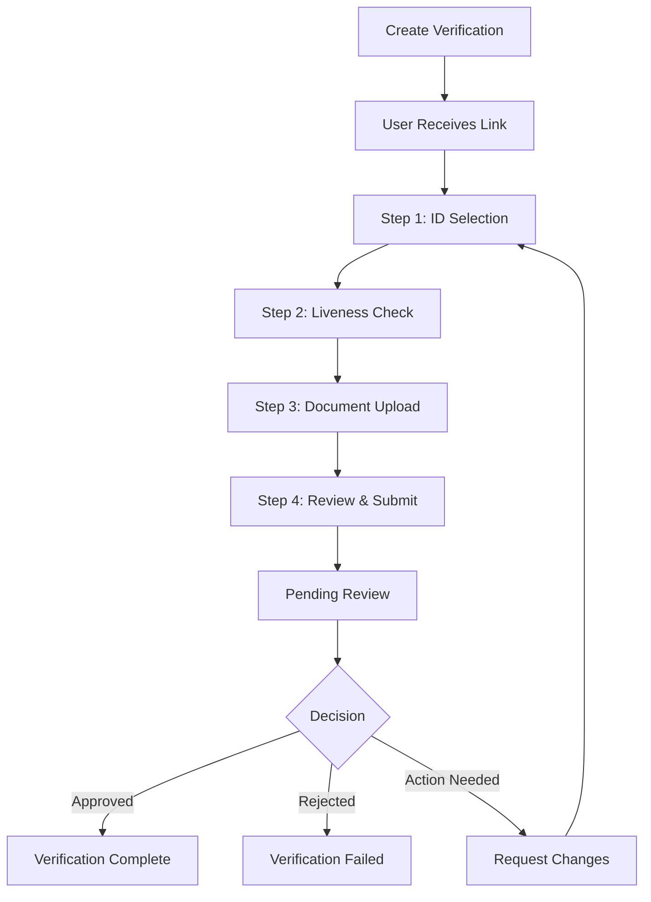

## Overview



## Step-by-Step Flow

### Step 0: Create Verification

Your application creates a verification via API:

```bash
curl -X POST 'https://clear-api.nfigate.com/api/v1/verifications' \
  -H 'X-API-Key: nfi_...' \
  -d '{
    "subjectType": "kyc",
    "subjectReference": "user-123"
  }'
```

### Step 1: ID Selection

User selects:
- **Residence Country** - Where they currently live
- **Document Country** - Issuing country of ID
- **Document Type** - Passport, National ID, or Driver's License

<Info>
  Document requirements vary by country. Not all document types are available in all countries.
</Info>

### Step 2: Liveness Check

User performs biometric verification:
- Real-time face detection
- Liveness challenge (turn head, blink, etc.)
- Selfie capture with automatic quality checks

**Technical Requirements:**
- Modern browser with camera access
- Good lighting conditions
- Stable internet connection

### Step 3: Document Upload

User uploads ID documents:
- **Front side** (required for all)
- **Back side** (required for National ID and Driver's License)

**Supported Formats:**
- JPG/JPEG
- PNG
- PDF
- Max file size: 10MB

**Quality Checks:**
- Document edges visible
- Text readable
- No glare or blur
- All corners in frame

### Step 4: Review & Submit

User reviews all information before submission:
- Preview of uploaded documents
- Option to retake photos
- Consent confirmation
- Final submission

### Step 5: Review

Submitted for manual or automated review:
- Document authenticity check
- Biometric matching (selfie vs. document photo)
- Data extraction verification

## Status Tracking

### Progress Steps

| Step | Name | Description |
|------|------|-------------|
| 0 | Intro | Introduction screen |
| 1 | ID Selection | Country and document selection |
| 2 | Liveness Check | Biometric verification |
| 3 | Document Upload | ID document capture |
| 4 | Review & Submit | Final review and submission |

### Current Step in API

```json
{
  "data": {
    "currentStep": 2,
    "status": "pending"
  }
}
```

## Webhook Events

| Event | Description |
|-------|-------------|
| `verification.created` | Verification created |
| `verification.started` | User began the flow |
| `verification.submitted` | User completed all steps |
| `verification.approved` | Verification approved |
| `verification.rejected` | Verification rejected |
| `verification.action_needed` | Corrections requested |

## Submitted Data Structure

When verification is complete, you'll receive:

```json
{
  "submittedData": {
    "residenceCountry": "Singapore",
    "documentCountry": "Singapore",
    "documentType": "passport",
    "frontImageUrl": "https://storage.../front.jpg",
    "backImageUrl": "https://storage.../back.jpg",
    "selfieImageUrl": "https://storage.../selfie.jpg",
    "livenessImages": [
      "https://storage.../liveness1.jpg",
      "https://storage.../liveness2.jpg"
    ],
    "submittedAt": "2024-01-15T10:30:00Z",
    "subjectType": "KYC"
  }
}
```

## Document Types by Country

### Singapore
- Passport
- National Registration Identity Card (NRIC)
- Driver's License

### Malaysia
- Passport
- MyKad (National ID)
- Driver's License

### Indonesia
- Passport
- KTP (National ID)
- Driver's License

<Info>
  Contact support for the full list of supported countries and document types.
</Info>

## Security Features

- **Anti-spoofing**: Liveness detection prevents photo attacks
- **Document verification**: MRZ checks on passports
- **Data encryption**: All images encrypted at rest
- **Secure transmission**: TLS 1.3 for all uploads
- **Fraud detection**: Automated risk scoring

## Time to Complete

| Step | Estimated Time |
|------|---------------|
| ID Selection | 1-2 minutes |
| Liveness Check | 2-3 minutes |
| Document Upload | 3-5 minutes |
| Review | 1 minute |
| **Total** | **7-11 minutes** |

Review time: Typically 1-5 minutes for automated checks, up to 24 hours for manual review.

## Best Practices

1. **Pre-verify camera access** before sending users to the link
2. **Provide clear instructions** about document requirements
3. **Set expectations** for review timeline
4. **Follow up** with users who don't complete within 24 hours
5. **Handle action_needed** status promptly

## Troubleshooting

| Issue | Solution |
|-------|----------|
| Camera not working | Check browser permissions, try different browser |
| Document rejected | Ensure good lighting, all edges visible |
| Liveness failed | Ensure face is centered, follow prompts slowly |
| Upload fails | Check file size (less than 10MB), try lower quality |

## Implementation Example

```javascript
// Create KYC verification
const createKycVerification = async (user) => {
  const response = await fetch('https://clear-api.nfigate.com/api/v1/verifications', {
    method: 'POST',
    headers: {
      'X-API-Key': API_KEY,
      'Content-Type': 'application/json',
    },
    body: JSON.stringify({
      subjectType: 'kyc',
      subjectReference: user.id,
      metadata: {
        userEmail: user.email,
        tier: user.verificationTier,
      },
    }),
  });
  
  const data = await response.json();
  
  // Store verification ID
  await db.users.update(user.id, {
    kycVerificationId: data.data.id,
    kycStatus: 'pending',
  });
  
  // Send verification email
  await sendEmail({
    to: user.email,
    template: 'kyc-verification',
    data: {
      verificationUrl: data.data.verificationUrl,
      expiresIn: '7 days',
    },
  });
  
  return data.data;
};
```
