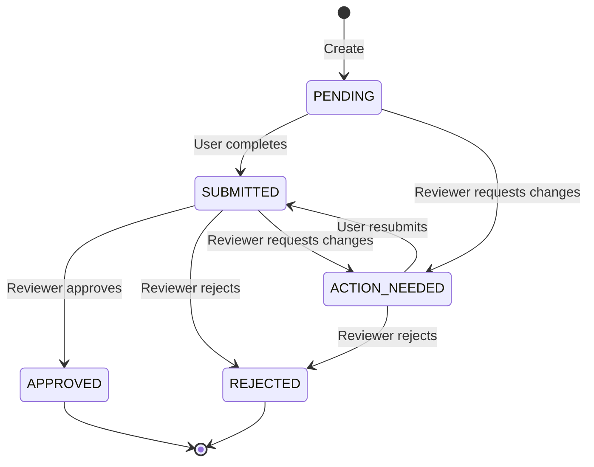

## Verification Lifecycle



## Statuses

| Status | Description | Next Actions |
|--------|-------------|--------------|
| `pending` | Created but not started | User begins verification |
| `submitted` | Completed by user, pending review | Reviewer approves/rejects/requests changes |
| `action_needed` | Corrections requested | User resubmits or reviewer rejects |
| `approved` | Verification approved | None - final state |
| `rejected` | Verification rejected | None - final state |

## Subject Reference

The `subjectReference` is your unique identifier for the subject being verified:

```json
{
  "subjectType": "kyc",
  "subjectReference": "user-12345"
}
```

### Best Practices

- Use your internal user/company ID
- Keep it consistent across API calls
- Make it unique within your organization

## Metadata

Store additional information with the verification:

```json
{
  "subjectType": "kyc",
  "subjectReference": "user-12345",
  "metadata": {
    "customerId": "cus_abc123",
    "userEmail": "user@example.com"
  }
}
```

## Verification URL

The `verificationUrl` is a unique link that you send to your user:

```
https://app.nfi-clear.com/verify/{verificationId}
```

### Delivery Methods

- Email
- SMS
- In-app notification
- QR code

## Retrieving Results

### Polling

```javascript
const checkStatus = async (id) => {
  const response = await fetch(`/api/v1/verifications/${id}`);
  const data = await response.json();
  return data.data.status;
};
```

## Data Retention

| Data Type | Retention Period |
|-----------|------------------|
| Verification record | Lifetime + 7 years |
| Submitted documents | 7 years |
| Access logs | 90 days |

## Best Practices

1. **Store the verification ID** in your database immediately after creation
2. **Send the URL promptly** to minimize time to completion
3. **Poll for status** at reasonable intervals (every 30-60 seconds)
4. **Cache verification status** briefly to reduce API calls

## Example Implementation

```javascript
class VerificationService {
  async createVerification(user) {
    // Create verification
    const response = await fetch('https://api.nfi-clear.com/api/v1/verifications', {
      method: 'POST',
      headers: {
        'X-API-Key': API_KEY,
        'Content-Type': 'application/json',
      },
      body: JSON.stringify({
        subjectType: 'kyc',
        subjectReference: user.id,
        metadata: {
          userEmail: user.email,
        },
      }),
    });
    
    const data = await response.json();
    
    // Store in database
    await db.verifications.create({
      id: data.data.id,
      userId: user.id,
      status: 'pending',
      url: data.data.verificationUrl,
    });
    
    // Send email
    await emailService.sendVerificationEmail(user.email, {
      url: data.data.verificationUrl,
    });
    
    return data.data;
  }
  
  async checkStatus(verificationId) {
    const response = await fetch(
      `https://api.nfi-clear.com/api/v1/verifications/${verificationId}`,
      {
        headers: { 'X-API-Key': API_KEY },
      }
    );
    
    const data = await response.json();
    
    // Update in database
    await db.verifications.update(verificationId, {
      status: data.data.status,
    });
    
    // Handle final status
    if (data.data.status === 'approved') {
      await this.onApproved(data.data);
    } else if (data.data.status === 'rejected') {
      await this.onRejected(data.data);
    }
    
    return data.data;
  }
}
```
