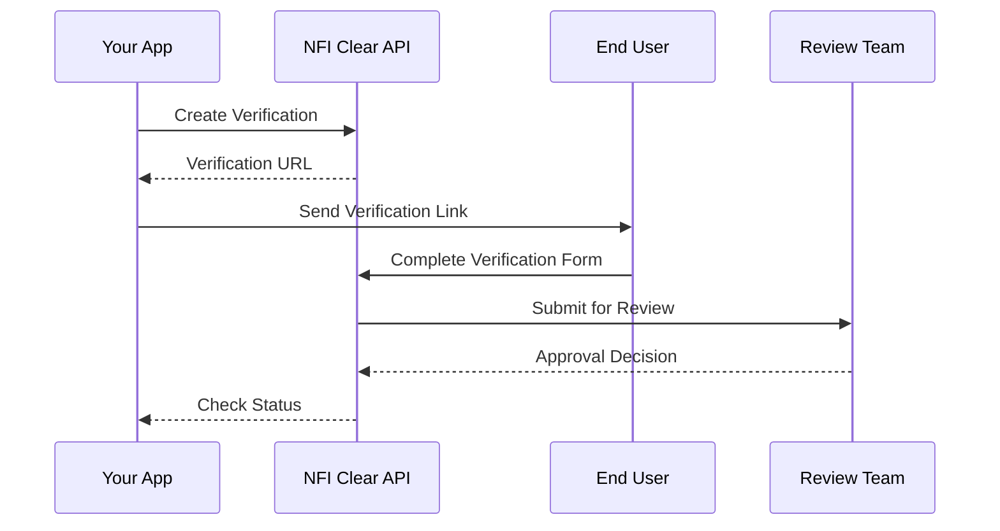

# Welcome to NFI Clear

NFI Clear is a comprehensive identity verification platform that enables businesses to perform **Know Your Customer (KYC)** and **Know Your Business (KYB)** verifications. Our API-first approach allows you to integrate verification capabilities directly into your applications.

## What We Offer

<CardGroup cols={2}>
  <Card title="KYC Verification" icon="user-check" href="/concepts/kyc-flow">
    Verify individual identities with document upload, liveness detection, and biometric matching
  </Card>
  <Card title="KYB Verification" icon="building" href="/concepts/kyb-flow">
    Comprehensive business verification including corporate structure and beneficial ownership
  </Card>
  <Card title="API-First Design" icon="code" href="/api-reference/overview">
    RESTful API for seamless integration
  </Card>
  <Card title="Progress Tracking" icon="chart-bar" href="/concepts/verifications">
    Real-time status updates and detailed progress tracking
  </Card>
</CardGroup>

## Verification Flow

## Getting Started

<CardGroup cols={2}>
  <Card title="Quickstart" icon="rocket" href="/quickstart">
    Create your first verification in 5 minutes
  </Card>
  <Card title="API Reference" icon="book-open" href="/api-reference/overview">
    Explore the available endpoints
  </Card>
</CardGroup>

## Support

Need help? Contact us at **support@nfi-clear.com**
